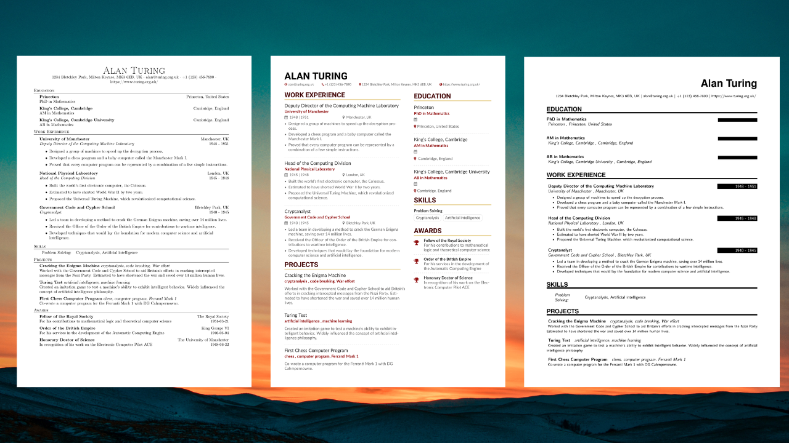

# ResuLLMe [](https://resullme.streamlit.app/) [](https://github.com/IvanIsCoding/ResuLLMe/blob/main/LICENSE) 

---



## 🚀 Concept

ResuLLMe is a prototype that uses Large Language Models (LLMs) to tailor résumés. It's goal is to enhance résumés to help candidates avoid common mistakes that occur while applying for jobs. It is like a smart career advisor to check your résumé.

You can use ResuLLMe live at [https://resullme.streamlit.app/](https://resullme.streamlit.app/).

## 🛠 How It Works

ResuLLMe receives your previous CV as a PDF or Word Document. Then, it uses LLMs to:
* Improve the résumé following published résumé guidelines by well-reputed schools
* Convert the résumés to a JSON Resume format
* Render the JSON resume using LaTeX to generate a new PDF of the enhanced resume

## 🏃 Running

To run ResuLLMe locally, execute:

```
streamlit run src/Main.py
```

Notice that you will need to install the dependencies in `requirements.txt` for your code to work, and install the packages in `packages.txt` for the LaTeX rendering to work (or equivalent if not using Ubuntu).

#I 🪄 Installation

$ sudo apt-get install < packages.txt

## 🤲 Contributing

ResuLLMe is an open source project.

If you want to contribute, open a [Pull requests](https://github.com/360macky/project-name/pulls). 
All contributions are welcome, but some that would particularly be useful to the community are:
* Fixes in existing LaTeX templates
* Adding new LaTeX templates
* Improved prompts
* Support for other LLMs (e.g. Bard, Claude, LLaMA)
